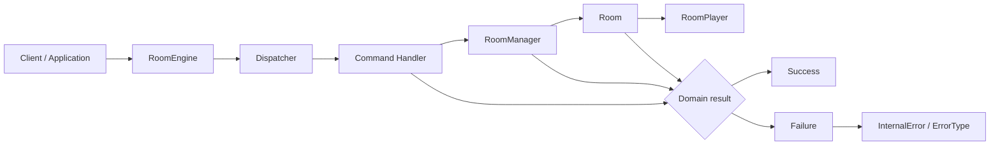

# Architecture

## Overview

Room Engine is a reusable Python domain engine for managing rooms, their members, and host ownership. It is transport-independent: applications provide commands to the engine and consume its domain results without coupling room behavior to a delivery mechanism.

The engine does **not** depend on FastAPI, WebSockets, HTTP, JSON, Discord, databases, or networking. Those concerns can be supplied by an application that uses the engine; they are not part of the current production package.

## Architectural Flow



`RoomEngine` receives a concrete command and delegates routing to `Dispatcher`. The dispatcher selects the matching handler, which invokes the shared `RoomManager`. The manager coordinates room lifecycle, while each `Room` owns membership and host-selection rules for its own players. Operations return `Success` or `Failure` values for expected domain outcomes.

## Component Responsibilities

### RoomEngine

The application-facing facade. It composes one `RoomManager`, one `Dispatcher`, and handlers for create, join, and leave commands. It is the boundary through which a caller executes supported room operations.

### Dispatcher

The command-routing mechanism. It maps each concrete `Command` type to a `Handler` and rejects unregistered command types. It contains no room or membership business rules.

### Command

The request model for engine operations. `CreateRoomCommand`, `JoinRoomCommand`, and `LeaveRoomCommand` carry the input required for their corresponding operation; they do not perform domain work themselves.

### Handler

The adapter between a command and the room domain. Each concrete handler extracts command data and invokes the corresponding `RoomManager` operation. Create, join, and leave handlers all use the manager supplied by the engine.

### RoomManager

The owner of the active-room collection and room lifecycle coordinator. It generates room codes, creates and finds rooms, delegates membership changes to a `Room`, and removes rooms when their final member leaves.

### Room

The aggregate for one room. It owns that room's player records, assigns the first member as host, records departures, elects a successor host by lowest local join-order ID, and supports explicit host transfer.

### RoomPlayer

The membership record connecting a user to a room. It holds the user ID, room code, role, join-order ID, join time, and optional leave time. `PlayerRole` distinguishes player, host, and spectator values, although the current join flow assigns only player or host roles.

### Success / Failure

The explicit domain result types returned by room operations. `Success` carries a value such as a created room, joined player, or leave result. `Failure` carries an `InternalError` for expected domain conditions instead of requiring callers to infer them from control flow.

### InternalError / ErrorType

The structured error model for expected failures. `InternalError` contains a stable `ErrorType`, a readable message, and optional contextual details. `ErrorType` identifies conditions such as a missing room, duplicate membership in a room, absent membership, or invalid host transitions.

## Dependency Direction

Dependencies point inward toward the room domain:

```text
Application / infrastructure
        -> RoomEngine -> Dispatcher -> Handler -> RoomManager -> Room -> RoomPlayer
```

Domain result and error types are shared return contracts used by the room and manager layers. The current code follows these rules:

- `Room` never depends on `Dispatcher`.
- `RoomManager` never depends on networking or a transport framework.
- `Dispatcher` contains no room business rules; it only registers and routes handlers.
- Infrastructure depends on the engine, never the opposite.
- Handlers depend on `RoomManager`; they do not own a separate room-state store.

## Shared State

Each `RoomEngine` constructs exactly one `RoomManager`. During initialization, it creates the create, join, and leave handlers with that same manager instance. Consequently, a room created through one command is available to subsequent join and leave commands executed by the same engine.

Different `RoomEngine` instances construct different `RoomManager` instances, so their active rooms and memberships are isolated from one another.

## Current Constraints

- State is held in memory in the `RoomManager`'s active-room collection.
- There is no persistence layer.
- There is no networking, transport protocol, or event delivery.
- There is no authentication or authorization layer.
- Command execution and domain operations are synchronous.
- Supported façade commands are room creation, joining, and leaving.
- A user cannot be added to the same room more than once.
- A global one-user-to-one-room invariant is **not** currently enforced; the manager can create or join rooms without checking the user's membership in other rooms.
- A room is removed when its last player leaves.
- When a host leaves a non-empty room, the remaining player with the lowest local join-order ID becomes host.

## Extension Points

Future applications can use `RoomEngine` as their domain boundary and adapt external input into the existing command objects. The same engine can be integrated by a CLI, FastAPI application, WebSocket server, Discord bot, multiplayer game, or chat system without embedding those technologies in the room domain.

An integration is responsible for transport concerns—request parsing, authentication, connection management, serialization, and delivery—and can translate engine `Success` and `Failure` results into its own responses.

## Testing Strategy

The repository uses `pytest` and organizes unit tests by layer:

- `tests/rooms/` verifies `Room` membership, host-selection, and `RoomManager` lifecycle and lookup behavior.
- `tests/handlers/` verifies create, join, and leave handlers against real `RoomManager` instances.
- `tests/engine/` verifies the `RoomEngine` facade, dispatcher configuration, shared manager state, independent engine state, unknown commands, and the create-to-join-to-leave flow.
- `tests/conftest.py` provides shared fixtures for room managers and handlers.

This organization exercises domain behavior directly and keeps façade tests focused on composition and routing rather than duplicating lower-level rules.

## Design Principles

- **Transport independence:** Room behavior is isolated from delivery protocols and frameworks.
- **Explicit responsibilities:** Commands describe intent, dispatchers route, handlers adapt, managers coordinate, and rooms enforce local membership rules.
- **Low coupling:** Domain components do not depend on infrastructure concerns.
- **High cohesion:** Room state and host behavior stay together in `Room`; active-room lifecycle stays in `RoomManager`.
- **Reusable components:** Applications can embed the same domain engine behind different interfaces.
- **Composition:** `RoomEngine` assembles the dispatcher, handlers, and shared manager instead of using global state.
- **Domain isolation:** `Success`, `Failure`, and structured errors make expected room outcomes available without transport-specific response types.
